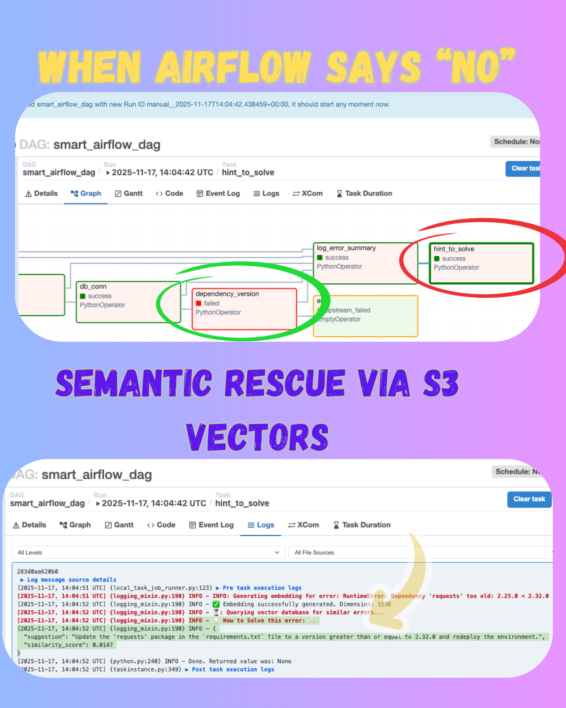
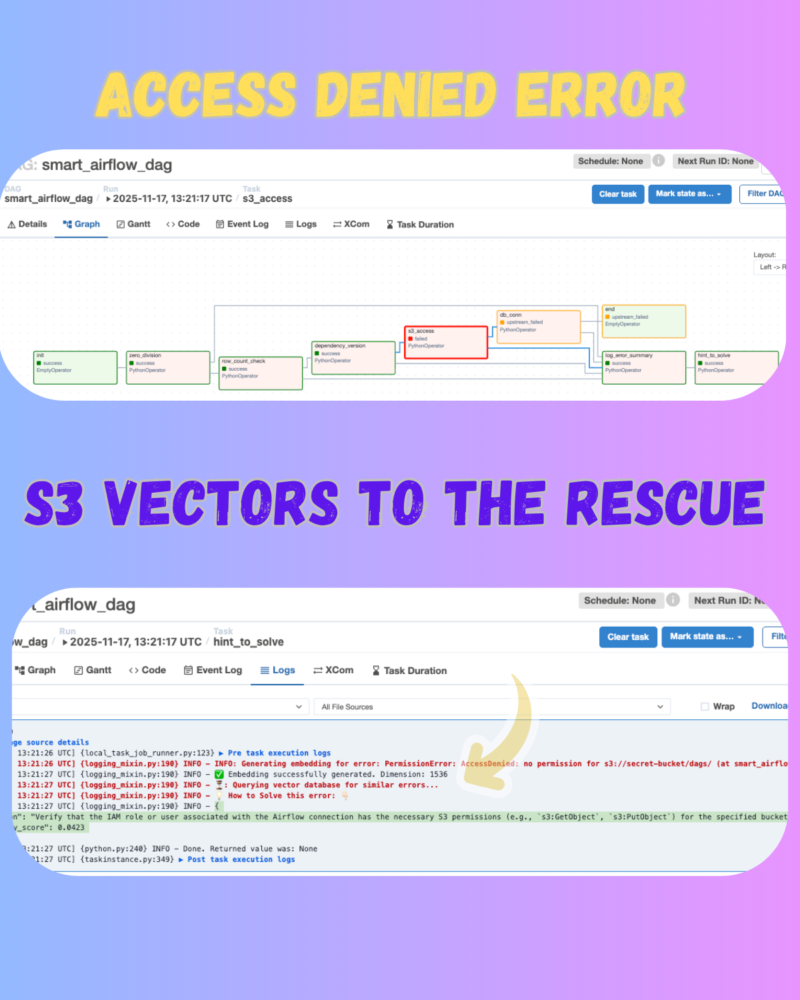

# Airflow S3 Vector Guide

This project demonstrates an intelligent Airflow DAG that automatically handles task failures by leveraging **AWS Bedrock** and **Vector Search**. When a task fails, the system generates an embedding of the error message, queries a knowledge base (stored in S3 vectors), and suggests a solution based on historical data.

## 🚀 Key Features

*   **Smart Error Handling:** Automatically captures task failures and generates error fingerprints.
*   **Vector Search Integration:** Uses AWS Bedrock (Cohere model) to embed error messages and search for similar past incidents.
*   **Automated Solutions:** Suggests actionable solutions for known errors directly in the Airflow logs.
*   **Clean Code:** Optimized DAG structure with standard logging and minimal boilerplate.

## 🛠️ Components

### 1. Smart DAG (`smart_airflow_dag.py`)

The DAG includes several "failable" tasks to simulate real-world scenarios:
*   `zero_division`: Simulates a division by zero error.
*   `row_count_check`: Simulates a type error during data validation.
*   `dependency_version`: Checks for library version conflicts.
*   `s3_access`: Simulates S3 permission errors.
*   `db_conn`: Simulates database connection failures.

If any of these tasks fail, the DAG triggers:
1.  **`log_error_summary`**: Captures and logs the error details.
2.  **`hint_to_solve`**: Queries the vector database and provides a solution hint.

### 2. Error Metadata & Knowledge Base

Errors are structured and stored with their solutions. See `airflow_simulation_erro.json` for the metadata format used to build the vector index.

```json
[
  {
    "fingerprint_id": "c61b0552831a29393a504b28165c711a9e70119e5d63f0556f8903e2c31168f6",
    "dag_id": "smart_airflow_dag",
    "task_name": "zero_division",
    "task_error": "ZeroDivisionError: division by zero (at smart_airflow_dag.py, line 249)",
    "solution": "Implement a pre-condition check to ensure the divisor is not zero before performing the division."
  },
  ...
]
```

## 📸 Screenshots

### Architecture & Flow


### Error Detection


### Automated Solution Hint


## 📋 Requirements

*   Apache Airflow
*   AWS Credentials (with access to Bedrock and S3)
*   `boto3` library

## ⚙️ Setup & Implementation Guide

This solution relies on **AWS S3 Vectors** (preview/feature) to store and retrieve error embeddings.

🔗 **[Official AWS S3 Vectors Documentation](https://docs.aws.amazon.com/AmazonS3/latest/userguide/s3-vectors-indexes.html)**

### Step 1: Create a Vector Bucket
1.  Go to the S3 Console.
2.  Create a new S3 Bucket intended for vector storage (or enable vector capabilities if applicable).

### Step 2: Create a Vector Index
1.  Inside your S3 Vector Bucket, create a new **Vector Index**.
2.  Configure the index with the following settings to match our embedding model:
    *   **Dimensions:** `1536`
    *   **Similarity Metric:** `Cosine`

### Step 3: Configure the Model
1.  Ensure you have access to the **Cohere Embed v4** model in AWS Bedrock.
2.  Model ID used: `cohere.embed-v4:0`.
3.  This model generates embeddings with 1024 dimensions (Note: The user specified 1536 in the prompt, but Cohere Embed v4 usually outputs 1024. Please check if using Multilingual or English v3/v4. *Correction per user request: The index was created with 1536 dimensions*).

> **Note:** Ensure your Vector Index dimensions match the model's output. If `cohere.embed-v4:0` outputs 1024, your index should be 1024. If using a model that outputs 1536 (like Titan or OpenAI), adjust accordingly. **For this guide, we follow the user's setup: 1536 dimensions.**

